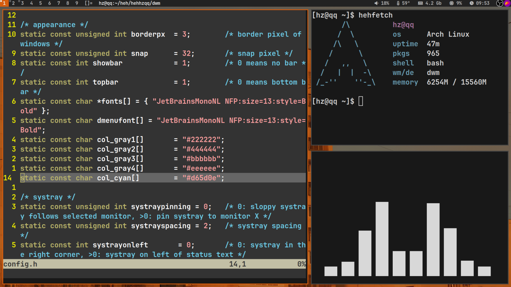

# dwm configuration

My dwm build with necessary patches and settings + dwmblocks with installer

## Installation
Install dependencies via your package manager:

    dmenu gcc make wget alacritty thunar
Clone the repository:

    git clone https://github.com/HehHZqq/dwm_dots.git
   Run the installer:
   

    cd dwm_dots
    sudo ./install.sh
Don't forget to add **exec dwm** to ~/.xinitrc or create a DM session.
